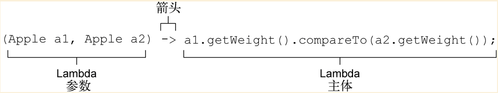

# java8 学习
## 1. linux cat命令流处理
cat命令会把两个文件连接起来创建一个流，tr会转换流中的字符，sort会对流中的行进行是排序，而tail -3 则给出流的最后三行，unix命令行允许这些程序通过管道符（|）连接一起，比如
```
cat file1 file2 | tr "[A-Z]" "[a-Z]" | sort | tail -3
```
上面命令先把字母转换成小写字母，然后打印出按照词典排序出现在最后的三个单词
## 2. Java 8中增加的另一个编程概念是通过API来传递代码的能力
Stream API就是构建在通过传递代码使操作行为实现参数化的思想上的，当把compareUsingCustomerId传进去，你就把sort的行为参数化了

## 1. java8 方法的引用
下面方法是获取当前路径下的隐藏文件
```java
File[] hiddenFiles = new File(".").listFiles(File::isDirectory);
```
只需用Java 8的方法引用 <font color=red><B>::</font> 语法（即“把这个方法作为值”）将其传给listFiles方法,下面例子需要导入import java.util.function.Predicate
``` java
import java.util.ArrayList;
import java.util.Arrays;
import java.util.List;
import java.util.function.Predicate;

public class FilteringApples {
    public static void main(String... args) {
        List<Apple> inventory = Arrays.asList(new Apple(80, "green"),
                new Apple(155, "green"),
                new Apple(120, "red"));
        List<Apple> greenApples = filterApples(inventory,FilteringApples::isGreenApple);
    }


    public static List<Apple> filterApples(List<Apple> inventory, Predicate<Apple> p) {

        List<Apple> result = new ArrayList<>();

        for (Apple apple : inventory) {

            if (p.test(apple)) {

                result.add(apple);

            }

        }

        return result;

    }

    public static boolean isGreenApple(FilteringApples.Apple apple) {

        return "green".equals(apple.getColor());

    }
}

```
## 2 从传递方法到Lambda
把方法作为值来传递显然很有用，但要是为类似于isHeavyApple和isGreenApple这种可能只用一两次的短方法写一堆定义有点儿烦人。不过Java 8也解决了这个问题，它引入了一套新记法（匿名函数或Lambda），让你可以写
```java
List<Apple> greenApples2 = filterApples(inventory, (Apple a) -> "green".equals(a.getColor()));
```
所以，你甚至都不需要为只用一次的方法写定义；代码更干净、更清晰，因为你用不着去找自己到底传递了什么代码。但要是Lambda的长度多于几行（它的行为也不是一目了然）的话，那你还是应该用方法引用来指向一个有描述性名称的方法，而不是使用匿名的Lambda。你应该以代码的清晰度为准绳
## Lambda
可以把Lambda表达式理解为简洁地表示可传递的匿名函数的一种方式：它没有名称，但它有参数列表、函数主体、返回类型，可能还有一个可以抛出的异常列表。这个定义够大的，让我们慢慢道来。

 匿名——我们说匿名，是因为它不像普通的方法那样有一个明确的名称：写得少而想得多！

 函数——我们说它是函数，是因为Lambda函数不像方法那样属于某个特定的类。但和方法一样，Lambda有参数列表、函数主体、返回类型，还可能有可以抛出的异常列表。

 传递——Lambda表达式可以作为参数传递给方法或存储在变量中。

 简洁——无需像匿名类那样写很多模板代码。
 ### 2.1 Lamdba表达式的组成

 Lambda表达式有三个部分，如图3-1所示。

 参数列表——这里它采用了Comparator中compare方法的参数，两个Apple。

 箭头——箭头->把参数列表与Lambda主体分隔开。

 Lambda主体——比较两个Apple的重量。表达式就是Lambda的返回值了。
### 2.2 函数式接口
函数式接口就是只定义一个抽象方法的接口。你已经知道了Java API中的一些其他函数式接口，如我们在第2章中谈到的Comparator和Runnable。
```java
public interface Comparator<T> {    ←─java.util.Comparator
    int compare(T o1, T o2);
}

public interface Runnable{    ←─java.lang.Runnable
    void run();
}

public interface ActionListener extends EventListener{    ←─java.awt.event.ActionListener
    void actionPerformed(ActionEvent e);
}
```
* Lambda表达式允许你直接以内联的形式为函数式接口的抽象方法提供实现，并把整个表达式作为函数式接口的实例（具体说来，是函数式接口一个具体实现的实例）
### 2.3 函数描述符
函数式接口的抽象方法的签名基本上就是Lambda表达式的签名。我们将这种抽象方法叫作函数描述符
方法的签名：方法的参数和返回值类型
## 2.3 使用函数式接口
Java8的库设计师帮你在java.util.function包中引入了几个新的函数式接口。我们接下来会介绍Predicate  [ˈpredɪkət]、Consumer和Function
1. java.util.function.Predicate<T>接口定义了一个名叫test的抽象方法，它接受泛型T对象，并返回一个boolean
2. java.util.function.Consumer<T>定义了一个名叫accept的抽象方法，它接受泛型T的对象，没有返回（void）
3. java.util.function.Function<T, R>接口定义了一个叫作apply的方法，它接受一个泛型T的对象，并返回一个泛型R的对象
### 2.4 函数式接口异常、和lambda异常
任何函数式接口都不允许抛出受检异常（checked exception）。如果你需要Lambda表达式来抛出异常，有两种办法：定义一个自己的函数式接口，并声明受检异常，或者把Lambda包在一个try/catch块中
```java
@FunctionalInterface
public interface BufferedReaderProcessor {
    String process(BufferedReader b) throws IOException;
}
BufferedReaderProcessor p = (BufferedReader br) -> br.readLine();
```
```java
Function<BufferedReader, String> f = (BufferedReader b) -> {
    try {
        return b.readLine();
    }
    catch(IOException e) {
        throw new RuntimeException(e);
    }
};
```
## 2.4 类型推断
Lambda语法中省去标注参数类型，当Lambda仅有一个类型需要推断的参数时，参数名称两边的括号也可以省略
```java
List<Apple> filterList = filterApples(list, apple -> apple.getColor().equals("green"));
//多个参数
Comparator<Apple> c = (a, b) -> a.getColor().compareTo(b.getColor());
```
## 2.5 lamdba中局部变量引用
局部变量必须显式声明为final，或事实上是final
## 2.6 方法的引用
当你需要使用方法引用时，目标引用放在分隔符::前，方法的名称放在后面。例如，Apple::getWeight就是引用了Apple类中定义的方法getWeight。请记住，不需要括号，因为你没有实际调用这个方法。方法引用就是Lambda表达式(Apple a) -> a.getWeight()的快捷写法
### 2.6.1 构架方法引用
方法引用分3类
(1) 指向静态方法的方法引用（例如Integer的parseInt方法，写作Integer::parseInt）。
(2) 指向任意类型实例方法的方法引用（例如String的length方法，写作String::length）。
(3) 指向现有对象的实例方法的方法引用（假设你有一个局部变量expensiveTransaction用于存放Transaction类型的对象，它支持实例方法getValue，那么你就可以写expensiveTransaction::getValue）。

## 2.7 复合Lambda表达式的有用方法
### 2.7.1 比较器复合
1. 逆序
```java
inventory.sort(comparing(Apple::getWeight).reversed());    ←─按重量递减排序
```
2. 比较器链
```java
inventory.sort(comparing(Apple::getWeight)
         .reversed()                             ←─按重量递减排序
         .thenComparing(Apple::getCountry));    ←─两个苹果一样重时，进一步按国家排序
```
### 2.7.2 谓词复合
谓词接口包括三个方法：negate、and和or，让你可以重用已有的Predicate来创建更复杂的谓词。比如，你可以使用negate方法来返回一个Predicate的非，比如苹果不是红的
请注意，and和or方法是按照在表达式链中的位置，从左向右确定优先级的。因此，a.or(b).and(c)可以看作(a || b) && c。
### 2.7.3 函数复合
你还可以把Function接口所代表的Lambda表达式复合起来。Function接口为此配了andThen和compose两个默认方法，它们都会返回Function的一个实例
```java
Function<Integer, Integer> f = x -> x + 1;
Function<Integer, Integer> g = x -> x * 2;
Function<Integer, Integer> h = f.andThen(g);    ←─数学上会写作g(f(x))或(g o f)(x)
int result = h.apply(1);    ←─这将返回4
```
```java
Function<Integer, Integer> f = x -> x + 1;
Function<Integer, Integer> g = x -> x * 2;
Function<Integer, Integer> h = f.compose(g);    ←─数学上会写作f(g(x))或(f o g)(x)
int result = h.apply(1);    ←─这将返回3
```

# 3. 函数式数据处理
* 只能遍历一次
## 3.1 筛选和切片
1. 用谓词筛选
Streams接口支持filter方法（你现在应该很熟悉了）。该操作会接受一个谓词（一个返回boolean的函数）作为参数，并返回一个包括所有符合谓词的元素的流
2. 流还支持一个叫作distinct的方法，它会返回一个元素各异（根据流所生成元素的hashCode和equals方法实现）的流
3. 截短流
流支持limit(n)方法，该方法会返回一个不超过给定长度的流。所需的长度作为参数传递给limit。如果流是有序的，则最多会返回前n个元素。比如，你可以建立一个List
limit也可以用在无序流上，比如源是一个Set。这种情况下，limit的结果不会以任何顺序排列
4. 跳过元素
流还支持skip(n)方法，返回一个扔掉了前n个元素的流。如果流中元素不足n个，则返回一个空流。请注意，limit(n)和skip(n)是互补的
## 3.2 映射
一个非常常见的数据处理套路就是从某些对象中选择信息。比如在SQL里，你可以从表中选择一列。Stream API也通过map和flatMap方法提供了类似的工具
1. 对流中每一个元素应用函数
* 流支持map方法，它会接受一个函数作为参数。这个函数会被应用到每个元素上，并将其映射成一个新的元素（使用映射一词，是因为它和转换类似，但其中的细微差别在于它是“创建一个新版本”而不是去“修改”）
* flatmap方法让你把一个流中的每个值都换成另一个流，然后把所有的流连接起来成为一个流
```java
List<Integer> numbers1 = Arrays.asList(1, 2, 3);
List<Integer> numbers2 = Arrays.asList(3, 4);
List<int[]> pairs =
    numbers1.stream()
            .flatMap(i -> numbers2.stream()
                                  .map(j -> new int[]{i, j})
                    )
            .collect(toList());
```
## 3.3 查找和匹配
另一个常见的数据处理套路是看看数据集中的某些元素是否匹配一个给定的属性。Stream API通过allMatch、anyMatch、noneMatch、findFirst和findAny方法提供了这样的工具
1. 检查谓词是否至少匹配一个元素
anyMatch方法可以回答“流中是否有一个元素能匹配给定的谓词,anyMatch方法返回一个boolean，因此是一个终端操作。
```java
if (Dish.menu.stream().anyMatch(Dish::isVegetarian)) {
    System.out.println(true);
}
```
2. 检查谓词是否匹配所有元素,allMatch是一个终端操作,allMatch相对的是noneMatch。它可以确保流中没有任何元素与给定的谓词匹配
```java
if (Dish.menu.stream().allMatch(menu -> menu.getCalories() < 10000)) {
    System.out.println(true);
}
```
3. 查找元素
findAny方法将返回当前流中的任意元素。它可以与其他流操作结合使用
```java
Optional<Dish> any = Dish.menu.stream().filter(Dish::isVegetarian).findAny();
```
4. Optional简介
Optional<T>类（java.util.Optional）是一个容器类，代表一个值存在或不存在。在上面的代码中，findAny可能什么元素都没找到。Java 8的库设计人员引入了Optional<T>，这样就不用返回众所周知容易出问题的null了
* isPresent()将在Optional包含值的时候返回true, 否则返回false
* ifPresent(Consumer<T> block)会在值存在的时候执行给定的代码块。
  ```java
  Optional<Dish> any = Dish.menu.stream().filter(dish -> dish.getCalories()>100).findAny();
  any.ifPresent(dish -> System.out.println(dish.getName()));
  ```
* T get()会在值存在时返回值，否则抛出一个NoSuchElement异常。
* T orElse(T other)会在值存在时返回值，否则返回一个默认值
5. 查找第一个元素
有些流有一个出现顺序（encounter order）来指定流中项目出现的逻辑顺序（比如由List或排序好的数据列生成的流）。对于这种流，你可能想要找到第一个元素。为此有一个findFirst方法，它的工作方式类似于findany
* 何时使用findFirst和findAny
答案是并行。找到第一个元素在并行上限制更多。如果你不关心返回的元素是哪个，请使用findAny，因为它在使用并行流时限制较少。
## 3.4 归约
将流归约成一个值，用函数式编程语言的术语来说，这称为折叠（fold），因为你可以将这个操作看成把一张长长的纸（你的流）反复折叠成一个小方块，而这就是折叠操作的结果
### 3.4.1 元素求和
reduce接受两个参数：
* 一个初始值，这里是0
一个BinaryOperator<T>来将两个元素结合起来产生一个新值，这里我们用的是lambda (a, b) -> a + b
```java
public void reduce(){
    List<Integer> list = Arrays.asList(1, 2, 3, 4, 5, 6, 8);
    int sum = list.stream().reduce(0,(a,b)->a+b);
    System.out.println(sum);
}
```
方法引用
```java
list.stream().reduce(0,Integer::sum)
```
### 3.4.2 最大值和最小值
```java
Optional<Integer> maxOpt = list.stream().reduce(Integer::max);
maxOpt.ifPresent(a-> System.out.println("最大值："+a));

Optional<Integer> minOpt = list.stream().reduce(Integer::min);
minOpt.ifPresent(a-> System.out.println("最小值："+a));
```
# 2 概念
1. 谓词：一个返回布尔值得函数
2. 行为参数化：一个方法接受多种行为（或策略）作为参数，并在内部使用它们，来完成不同的行为的能力
