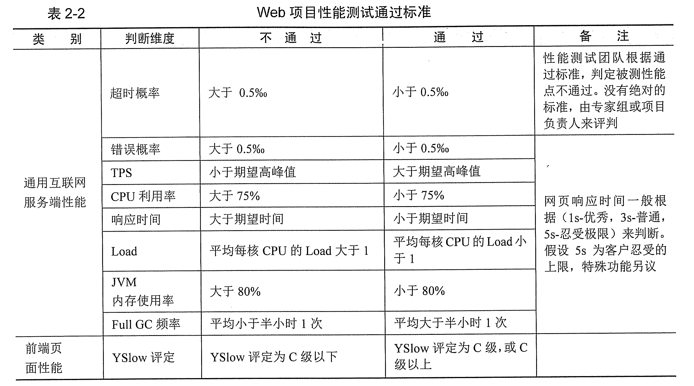

## 性能测试相关术语

###1. TPS
每秒完成的事务数，通常指每秒成功的事务数，是性能测试中重要的综合性能指标

###2. RT/ART(Response Time/average Response Time)
相应时间/平均相应时间，通常ART和RT代表同一个意思

###3. PV(Page View)
每秒用户访问页面的次数，用来分析平均每秒有多少个用户访问页面

###4. Vuser虚拟用户(Virtual user)

###5. Concurrency并发
并发分为狭义和广义两类。狭义的并发，即多个用户同一时刻做相同的事情，广义的并发，是在多个用户在同一个时刻做相同或不同的事情，狭义多用于性能测试、负载测试、压力测试、稳定性测试

###5. Scenario(场景)
为模拟真是用户的业务处理过程
###6. Think Time(思考时间)
1. 业务角度，用户在操作时，每个请求之间的间隔时间
2. 脚本角度，脚本中两个请求语句之间的间隔时间

###6. 标准差(Std. Deviation)
标准差越小说明波动越小，系统稳定，反之不然，包括响应时间标准差，TPS标准差，Running Vuser标准差，Load标准差，CPU资源利用率标准差，Web Resources 标准差等

###7.性能测试通过标准

 
