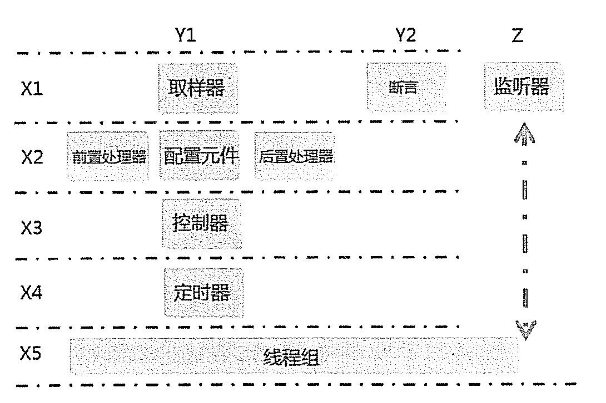

## JMeter体系结构
### 1. 名词
1. 元件：JMeter工具菜单中的一个子菜单，比如HTTP请求、事务控制器、响应断言等
2. 组件：一组元件的集合
1. X1-X5是负载模拟的一个过程，使用这些组件来完成负载的模拟
2. Y1：包含的是负载模拟的部分，负责模拟用户请求
3. Y2：结果验证部分，负责验证结果的正确性
4. Z：负载结果的搜集，只有一个组成部分--监听器，监听器可以放在线程组内或者外，所以途中是相交的
### 2. JMeter结构图

### 2. JMeter基本原理
1. JMeter基本原理是建立一个线程池，多线程运行取样器产生大量负载，在运行过程中通过断言来验证结果的正确性，通过监听器来记录测试结果。
2. 如果取样器中有参数变化的需求，可以通过X2中的配置元件或前置处理器完成
3. 如果有关联需求，可以通过后置处理器完成
4. 如果我们想要设置运行场景，比如模拟多少个用户，运行多长时间，就设置线程组
5. 如果想要模拟并发场景，可以利用定时器来设置
6. 如果我们想要控制业务的执行逻辑，比如登录只运行一次，我们可以用控制器来完成

### 3. 【X1】取样器
1. 取样器访问路劲： 测试计划 → 线程组 → Sampler
2. 取样器有很多，包括Http、java、jdbc等
### 4. 【X1】断言
1. 断言访问路径：测试计划 → 断言/assertions
2. 用来验证结果是否正确，就是预设一个结果与实际结果匹配，匹配到则成功，反之失败
3. 比较常用的断言是，响应断言/response assertion

### 5. 【X1】监听器
1. 监听器访问路径：测试计划 → 监听器/listener
2. JMeter的测试结果需要添加监听器来收集，JMeter结果收集程序的设计模式就是监听器模式，监听器有两个任务
   1. 添加结果监听，并可以保存测试结果到文件
   2. 展示结果，JMeter可以以表格及图形的形式展现结果。在开发脚本时，可是查看结果树中的请求和相应数据，方便调试

### 6. 取样器、断言、监听器组合在一起就可以帮助我们完成发送请求、验证结果及记录结果三项工作

### 7. 【X2】前置处理器
1. 前置处理器访问路径：测试计划 → 前置处理器/pre processors
2. 我们在请求发送前可能会做一些环境或者参数的准备工作，那么可以在前置处理器中完成这些工作
3. 比如在对数据库操作前，需要建立一个数据库连接，那么前置处理器就可以完成这个功能

### 8. 【X2】配置元件
1. 配置元件访问路径：测试计划 → 配置元件
2. 主要用于数据的参数化，比如CSV Data Set Config，可以从文件中读取测试数据。
3. JMeter提供了众多的函数帮助我们动态生成数据
4. 配置元件还可以用来记录服务器返回的数据，比如 http Cache Manager，自动记录服务器返回的Cache信息。

### 9. 【X2】后置处理器
1. 后置处理访问器路径：测试计划 → 后置处理器
2. 后置处理器一般放在取样器之后，用来处理服务器返回的结果，比如一个web应用程序，我们登录后会后会返回一个SessionID，这个SessionID在登录之后的业务操作过程中会做为验证条件，验证用户是否合法登录。
3. 后置处理器就是专门用来对相应数据做处理的元件，JMeter的关联就是通过后置处理器完成
4. 前置处理器、配置元件、后置处理器都是为取样器提供数据支持的，取样器关注的是业务逻辑

### 10 【X3】控制器
1. 控制器访问路径：测试计划 → 线程组 → 逻辑控制器
2. 比如只需一次登陆邮箱，即可查看多封邮件这个场景，我们需要对登陆的次数控制，可以使用逻辑控制器中的仅一次控制器既可完成

### 11. 【X4】定时器
1. 定时器访问路径：测试计划 → 线程组 → 定时器
2. 模拟请求在同一个时刻发送，类似loadrunner的集合点，这只是其中一个功能
### 12. 【X5】线程组
1. 线程组访问路径：测试计划 → Threads (Users)
2. 用来模拟大量用户负载情况，我们设置线程数，一个线程代表一个用户

### 13. Test Fragment
1. 访问路径： 测试计划 → Test Fragment
2. 辅助组件，在此节点下可以放置任何元件，其作用如下
   1. 在脚本开发过程中用来备份元件
   2. 该节点下的元件可以被模块控制器调用，可以用它来模块化请求，相当于封装成一个方法供复用

### 14. 工作台
1. 不直接参与运行
2. JMeter录制Http协议脚本时用到它，在他下面建立http代理服务元件，设置代理信息后录制
3. 设置服务器监控（http mirror server）
4. 显示当前JMeter信息
5. 备份脚本，特别是在脚本调试过程中，可以把它作为一个元件暂存区
