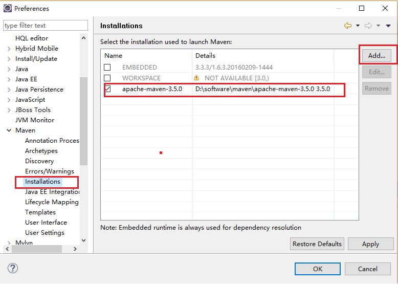

## 1.maven安装
### 1.1 下载maven
http://maven.apache.org/download.cgi
### 1.2 配置环境变量
1. 将下载后的zip解压到指定目录如何 D:\software\apache-maven-3.5.2
2. 新建环境变量 M2_HOME=D:\software\apache-maven-3.5.2
3. 在path环境变量中添加 %M2_HOME%/bin

### 1.2 验证maven是否安装成功
1. echo %M2_HOME%
2. mvn -v 查看maven版本信息

### 1.3 升级maven
将新的maven解压到本地目录，然后更新M2_HOME环境变量即可

### 1.4 ~/.m2
1. 执行 mvn help:system 命令，将打印所有的java属性和环境变量，运行这条命令的意思是让maven执行一个真正的任务，我们可以从命令行输出看到会下载maven-help-plugin，包含pom和jar文件，这些文件都会被下载到maven的本地厂库
2. 你可以在用户目录下发现.m2文件夹，如C:\Users\lenovo\.m2，该文件夹放置了maven的本地仓库.m2/repository，可以在C:\Users\lenovo\.m2\repository\org\apache\maven\plugins\maven-help-plugin目录下看到刚才下载的maven-help-plugin

### 1.4 设置http代理
因为公司出于安全考虑无法直接访问公共的maven库
现在有公司有一台代理服务器 218.14.227.197 端口3128
修改 ~/.m2/settings.xml文件（如果没有，复制$M2_HOME/conf/settings.xml文件）

### 1.5 设置MAVEN_OPTS环境变量
因为mvn命令实际上是执行的java命令，那么java命令可用参数，在运行mvn命令时也可使用
通常设置设置MAVEN_OPTS环境变量为-Xms128m -Xmx512m,以满足maven运行需要

### 1.6 配置用户范围的settings.xml文件
Maven可以选择配置$M2_HOME/conf/settings.xml或者~/.m2/settings.xml文件,前者是全局范围，影响机器上的所有用户，后者是用户范围
推荐使用用户范围，影响范围下，方便升级，升级时不会动到settings.xml文件

### 1.7 不要使用IDE自带的maven
版本新，可能不稳定
### 1.8 eclipse加载外部maven

