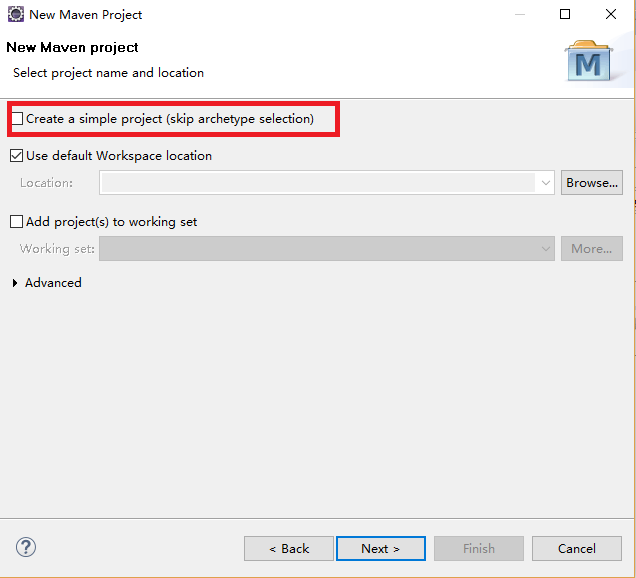
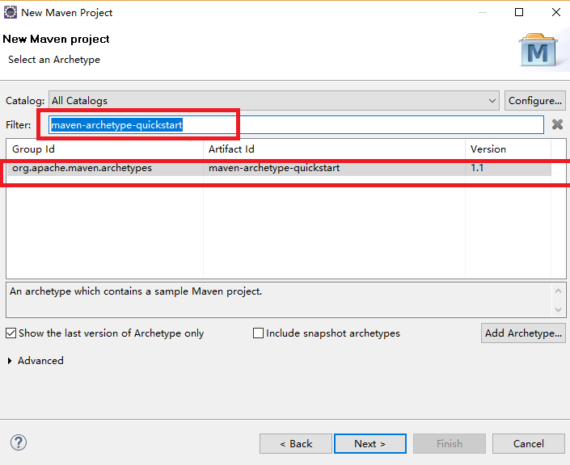
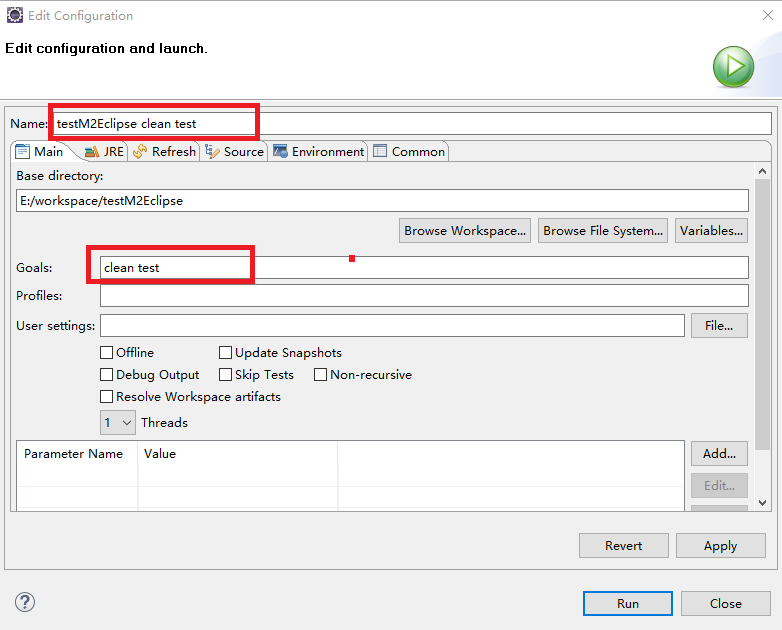
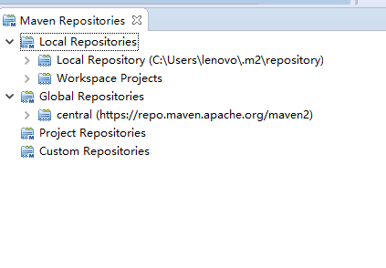

##1. eclipse中maven使用

###1.1 导入Maven项目
File → Import → Maven → Existing MAVEN Projects 单机next，出现Import Project对话框，然后选择maven项目

###1.2 创建MAVEN项目

1. File → New → Other 选择 Maven 下的 Maven Project，点击next，在弹出框中使用默认选项，不要选择Create a simple project

2. 选择maven-archetype-quickstart

3. 按照提示填写信息即可

###1.3 在eclipse中运行maven命令
1. 在项目名称或pom文件上右击，选择Run As 就能看到一些常用命令
2. 执行自定义命令，在Run As 菜单列表中选择 Maven build...(有点)，在弹出框中Goals位置输入命令，在name位置输入自定义的命令名称

3. 在Run As 菜单列表中选择 Maven build(无点)，可以看到自定义的命令列表，当只定义了一个命令的情况，会默认执行。

###1.4 Maven仓库视图
1. Window → Show View → Others 选择Maven下的Maven Repositories

2. 视图中包括的仓库分别为：本地仓库、全局仓库、项目仓库
3. 本地仓库：包好Maven本地仓库和当前eclipse工作区的项目
4. 全局仓库：默认是Maven中央仓库，但如果settings.xml中设置了镜像，全局仓库自动变为镜像仓库
5. 项目仓库：如果当前Maven项目的pom.xml中配置了其他仓库，他们就会被自动加入到项目仓库中
6. 这几个仓库的信息来源于用户的settings.xml文件和工作区中Maven项目的pom文件
###1.5 仓库右键菜单列表
eclipse不是真正的储存所有仓库的内容，使用nexus-indexer 索引仓库的内容信息
1. Update Index 让eclipse以增量的方式下载索引文件，速度快，建议更新中央库时使用这种方式
2. Rebuild Index 重新下载全部索引，很慢，本地仓库更新索引使用这种方，因为本地仓库Update Index 不可用
3. Disable Index Details 让eclipse关闭该仓库的索引，从而用户无法浏览仓库中内容，或对其进行搜索
4. Minimum Index Enable 表示只对仓库内容的坐标进行索引
5. Enable Full Index 不仅索引仓库内容坐标，还索引这些文件包含的java类信息，从而能够支持用户搜索仓库中的java类
