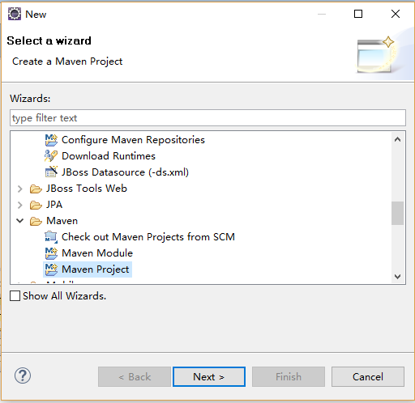
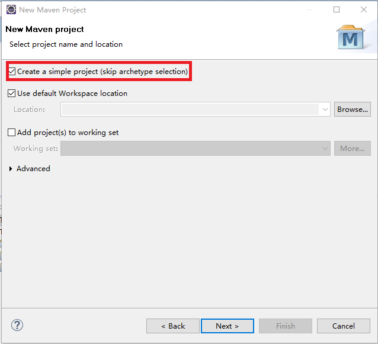
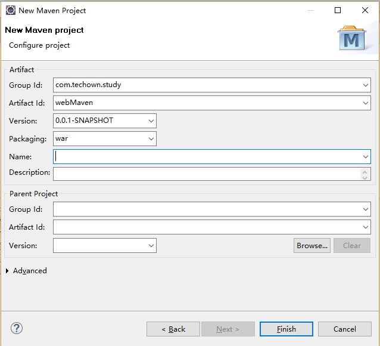
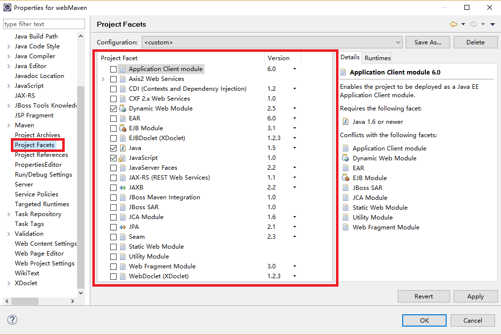
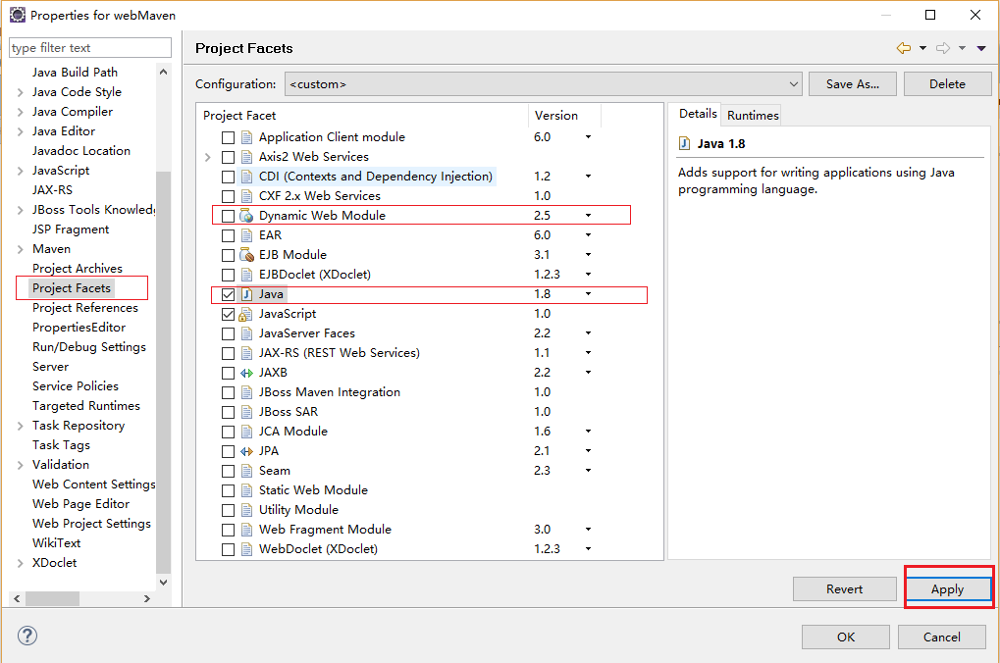
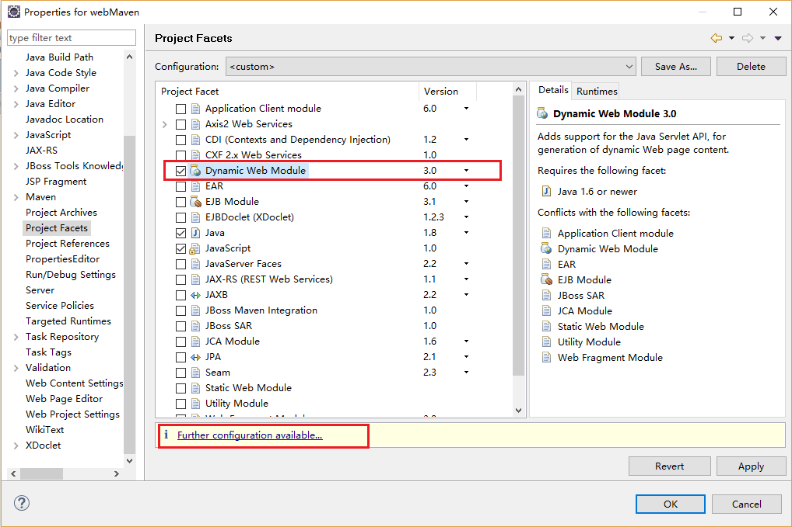
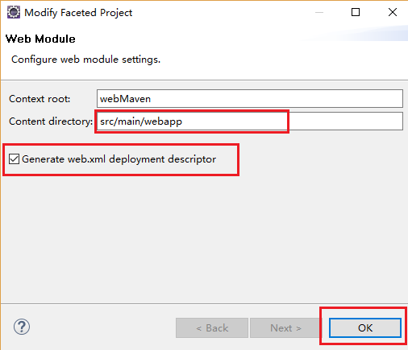

# Eclipse创建Maven Web项目

## 1. 选择 Maven Project，点击Next

## 2. 选中“Create a simple project(skip archetype selection)”，点击Next

## 3. 填写信息，点击Finish，创建出的Maven项目会提示缺少web.xml,继续执行下面操作，生成web.xml

## 4. 在项目上右击选择 → Properties → Project Facets

## 5. 不勾选“Dynamic Web Module”，将java版本修改成你想要设置的版本，我这里选择1.8，点击Apply，你会发现项目的jre变成1.8

## 6. 勾选“Dynamic Web Module”,选择3.0

## 7. 点击4-6图中的Further configuration available..,按照4-7图中填写Content director，然后勾选“General web.xml deployment descriptor”，点击OK,窗口关闭，点击外层窗口的Apply，最后点击OK，现在一个3.0版本的xml已经生成了

## 8. 修改pom.xml添加如下配置，然后在项目上右击选择Maven → Update Project...
    <build>
      	<plugins>
      		<plugin>
      			<groupId>org.apache.maven.plugins</groupId>
    	  		<artifactId>maven-compiler-plugin</artifactId>
    	  		<version>3.7.0</version>
    	  		<configuration>
    	  			<source>1.8</source>
    	  			<target>1.8</target>
    	  			<encoding>UTF-8</encoding>
    	  		</configuration>
      		</plugin>
      	</plugins>
      </build>
## 9. 已经完成Mave Web项目的创建
